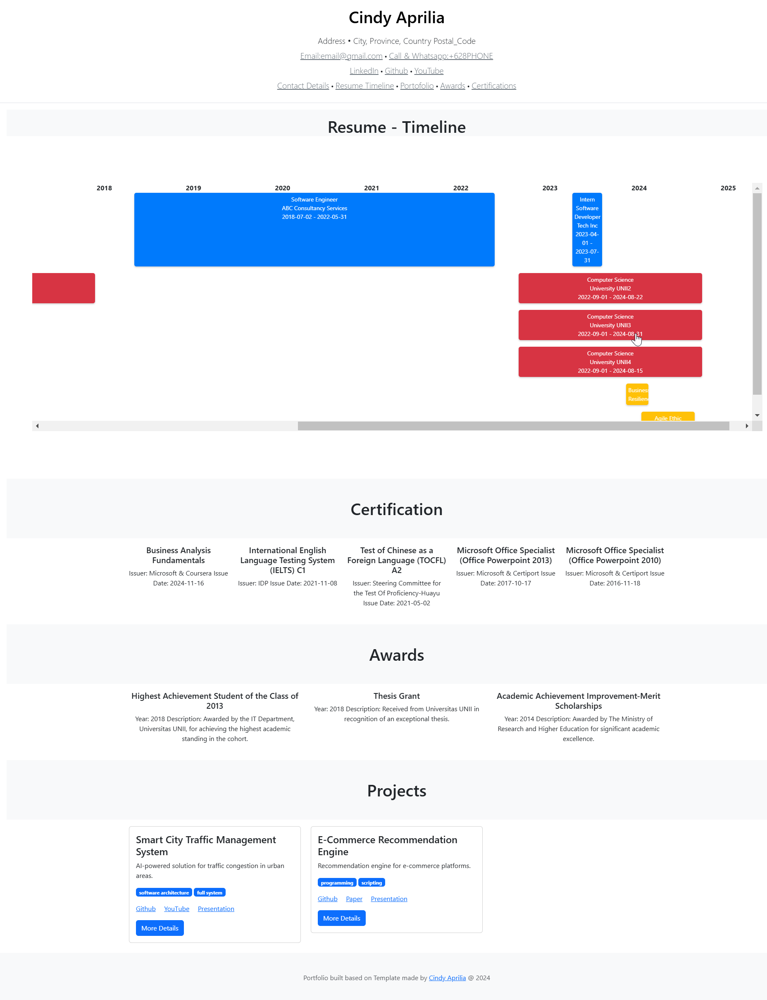
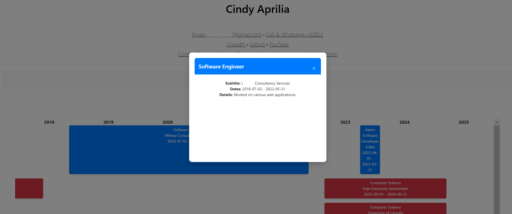

# Tech-Career Portfolio Template

This template is designed to help you build a portfolio to showcase your tech career. 
It includes sections for displaying your work, education, and publications using a chronological timeline chart. 
Additionally, it provides sections for certifications, awards, and projects.

## Demo

PS. demo.png and demo3.png is only for readme purpose, you can delete it after cloning

## How to generate the Portfolio?

**Run a PHP Server**  
    You can use XAMPP (for Windows) or Apache (for Linux) to run the PHP server.
    
**Clone the Repository**  
Clone the repository to your local machine and place it in the appropriate folder for your server : `https://github.com/cinapr/TechCareerPortfolioTemplate/` 
For example, for XAMPP on Windows, clone the project into the `htdocs` folder
    
**Edit Identity and Contact Info**  
Open `index.php` in your preferred text editor.
Modify this part: `header class="border-bottom lh-1 py-3"`, according to your name and contact info
    
**Edit the Data**  
Open `insert_activity.php` in your preferred text editor. 
Modify the data inside the `INSERT` query to match your profile information (work experience, education, publications, etc.).

PS1. In project, any link that you do not have, just empty out. In project, only Name, Tags, and Short Description are mandatory.
PS2. In project, there are several github link (github1,2,3,4). It is for covering the case for your project have multiple github link (Like separate frontend-backend-communication). If the github code only exist in 1 repo, just empty out the other github link.
    
**Run PHP Initiation** 
Every time you make changes to `insert_activity.php`, run the following pages in your browser to initialize the changes: 
- `http://localhost/.../TechCareerPortfolioTemplate/database_setup.php` 
- `http://localhost/.../TechCareerPortfolioTemplate/insert_activity.php`
    
**Preview the Template**  
Open the page in your browser to see how it looks:
`http://localhost/.../TechCareerPortfolioTemplate/insert_activity.php`
Adjust your data and layout as needed to suit your preferences.
    
**Save as Static Files**  
Once you're satisfied with the template and it looks suitable, save the page as a static file (webpage, complete) using your browser’s "Save As" feature.
    
**Create a GitHub Repository**
    -   Go to GitHub and log into your account.
    -   Click on the `+` icon in the top-right corner and select *New Repository*.
    -   Name your repository (e.g., `yourusername.github.io`), ensuring that it matches your GitHub username. This is required for a personal website hosted on GitHub Pages.
    -   Set the repository to *Public*.
    -   Click *Create Repository*.

**Commit and Push the Files**
    -   Upload all your saved webpage files (from Step 6) to your new GitHub repository.
    `git init
    git add .
    git commit -m "Initial commit"
    git remote add origin https://github.com/yourusername/yourusername.github.io.git
    git push -u origin main` 
    
    
**Enable GitHub Pages**
-   Go to your repository's page on GitHub (e.g., `https://github.com/yourusername/yourusername.github.io`).
-   Click on the *Settings* tab.
-   Scroll down to the *GitHub Pages* section.
-   Under the **Source** section, select the branch (usually `main` or `master`) that contains your HTML files.
-   If prompted, select the `/root` folder as the source for GitHub Pages.
-   GitHub will automatically generate the site, and you should see a message with the URL: `https://yourusername.github.io`.

**Visit Your Website**  
After a few minutes, your website will be live. Visit it at:
`https://yourusername.github.io`

## License and Acknowledgement
**License**
This template is free to use for personal purposes only. 
Any usage of this template, including modifications, must include the following attribution in a prominent location on your website:
`This template was created by [Cindy Aprilia](https://www.linkedin.com/in/apriliacindy). `
Note: If you wish to use this template for commercial purposes, please contact me for permission.

**Acknowledgement**
Check on the LICENSE file.
